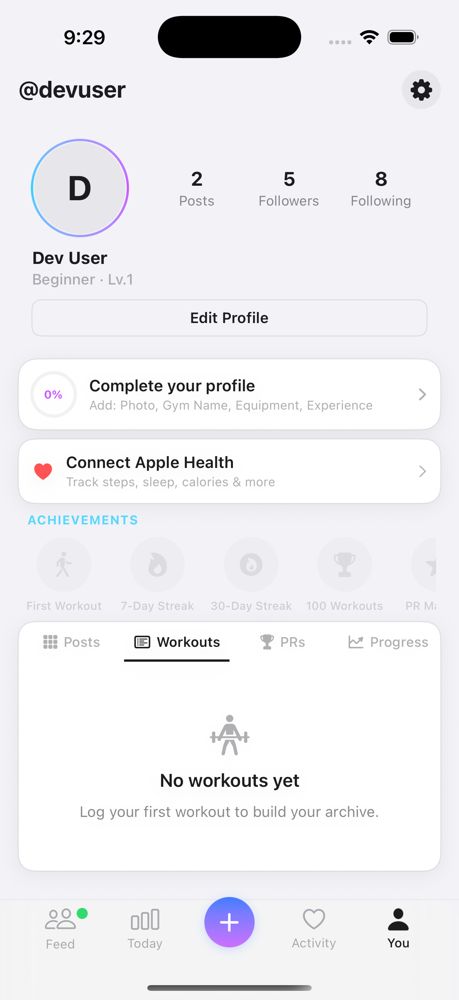
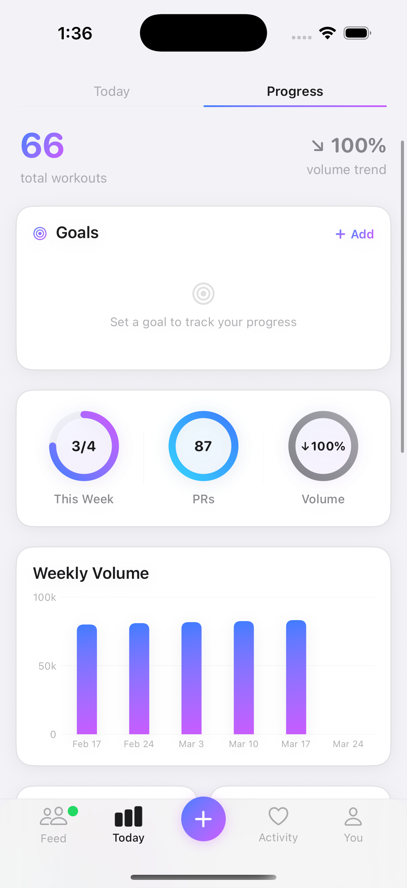
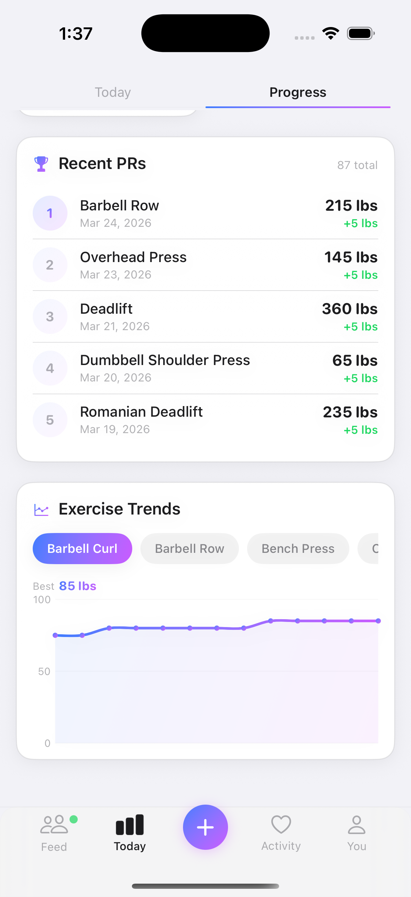
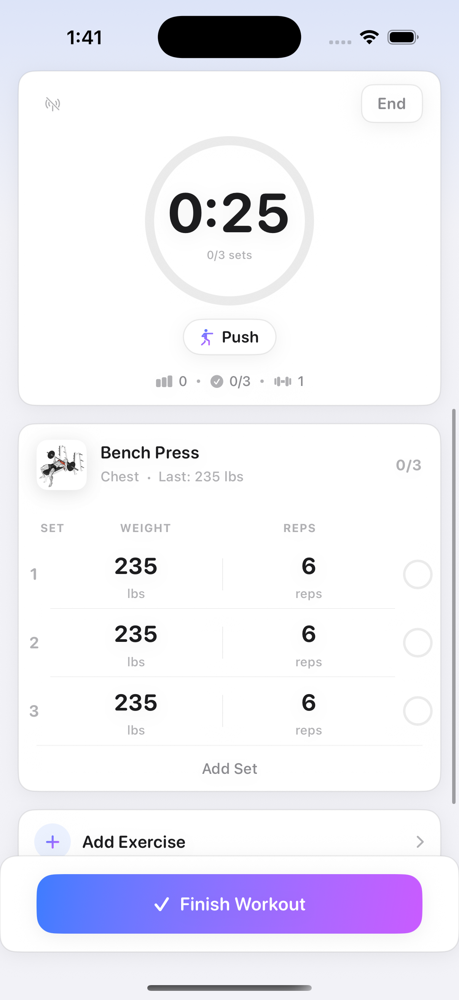
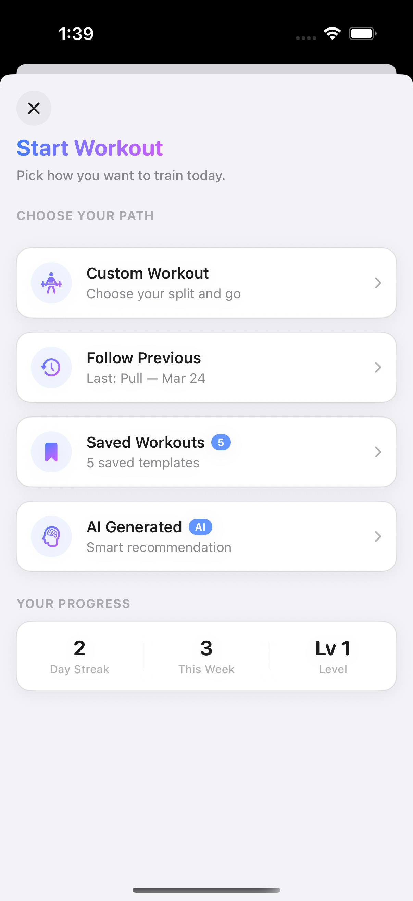
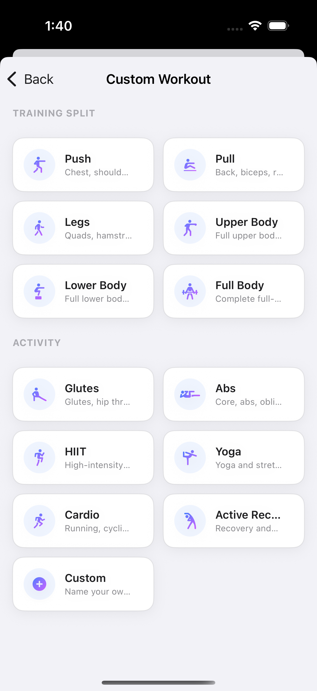
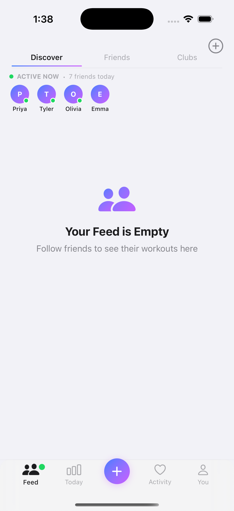
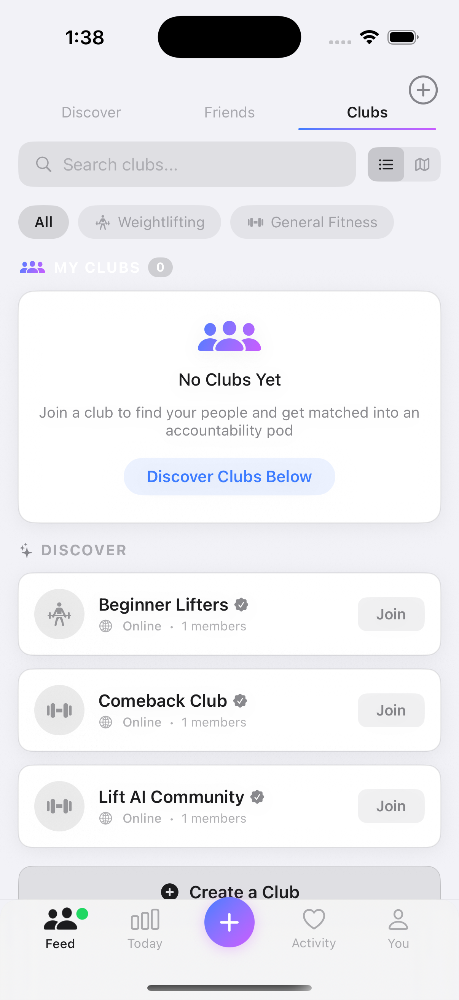
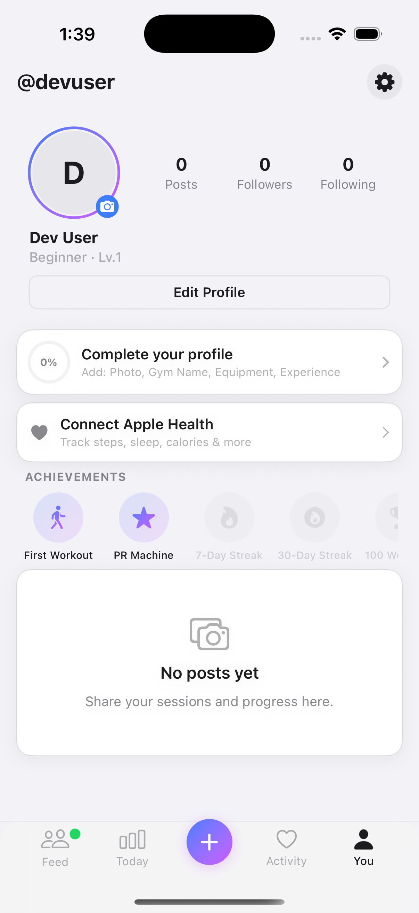

# GymQuest

Gamified fitness app for iOS. Real time workout tracking, multi provider AI coaching, RPG style progression.

> SwiftUI · SwiftData · Swift 5.9 · iOS 17+ · XcodeGen

<p align="center">
  
  &nbsp;&nbsp;
  
  &nbsp;&nbsp;
  
</p>

<p align="center">
  
  &nbsp;&nbsp;
  
  &nbsp;&nbsp;
  
</p>

<p align="center">
  
  &nbsp;&nbsp;
  
  &nbsp;&nbsp;
  
</p>

---

## Architecture (MVVM + Services)

```
Models/                          62 @Model classes
├── Core                           Workout, Exercise, ExerciseSet, PREvent
├── User & Social                  UserProfile, Post, Comment, Friend, Pod, Club, Squad
├── Gamification                   Quest, Challenge, ForgivenessToken, FistBump
├── AI & Coaching                  AILogEntry, ChatMessage, CoachNote
├── Health                         MealLog, BodyMeasurement, MilestoneEvent
└── Form Studio                    FormExercise, FormClip, FormCue, FormFault

ViewModels/                      @Observable state management
├── ActiveWorkoutViewModel         Live set tracking, timer, PR detection
├── AISetupChatViewModel           Onboarding chat flow
└── 6 Observable services          Acting as ViewModels (social, music, location…)

Views/                           63 SwiftUI views
├── Auth & Onboarding (6)          Login, AI chat onboarding, training plan offer
├── Dashboard (7)                  Today, Progress, Health, Coach dashboard
├── Workout (7)                    Active workout, start options, splits, templates
├── Social & Feed (9)              Discover, friends, educational, post editor
├── Community (8)                  Clubs, squads, pods, leaderboards
├── Profile & Analytics (6)        Profile, calendar history, body measurements
├── Monetization (4)               Paywall, integrations, notifications
├── Media (3)                      Form check camera, NowPlaying bar
└── Components (15)                Progress rings, 3D exercise viewer, voice notes

Services/                        53 singleton services (@MainActor)
├── AI                             AIService (OpenAI, Groq, Ollama, demo mode)
├── Workout                        PR detection, progressive overload, adaptation
├── Social                         Feed ranking, engagement tracking, challenges
├── Integrations                   Strava, Whoop, HealthKit, Apple Watch sync
├── Media                          Music, album art, speech recognition, voice notes
├── Infrastructure                 Auth, subscriptions, analytics, notifications
└── Seeders                        Mock data, discover content, social content

Features/                        Modular feature directories
└── FormStudio (18 files)          Form correction, video coaching, mastery tracking

Backend/                         Python FastAPI
├── main.py                        REST API with CORS
├── coach.py                       LangChain + Groq AI coaching
└── training_load.py               ACWR strain calculation
```

---

## Features

**Workout Engine** · Live set tracking, auto PR detection, rest timers with haptics, RPE, ghost data, milestone celebrations

**AI Coach** · Context aware coaching via OpenAI, Groq, Ollama, or offline demo mode

**Gamification** · 11 XP levels, quests, squad challenges, forgiveness tokens

**Social** · Workout cards, coach takeaways, media posts, fist bumps, pod accountability

**Form Studio** · Camera based form checking, 3D exercise viewer, video coaching

**Design System** · `GlassCard`, `StatPill`, progress rings, gradient accents, haptic patterns

---

## Testing & CI/CD

```
Tests/                           23 test files
├── Unit (5)                       Models, Services, ViewModels
├── Integration (3)                SwiftData lifecycle, network stubs
├── Performance (2)                Benchmarks, memory leak detection
├── Snapshot (2)                   Visual regression (iPhone 15 + SE)
├── UI (2)                         Smoke tests (login, clubs)
└── Accessibility (1)              VoiceOver audit
```

**CI/CD** · GitHub Actions · GitLab · Buildkite · CircleCI · Bitrise · Fastlane

**Security** · CodeQL · Dependabot · Semgrep · Trivy · Syft SBOM

---

```bash
brew install xcodegen && xcodegen generate && open GymQuest.xcodeproj
```

AI setup is optional. The app runs in Demo Mode without API keys.

---

**Benjamin Hilderman** · [@BenHilderman](https://github.com/BenHilderman)
