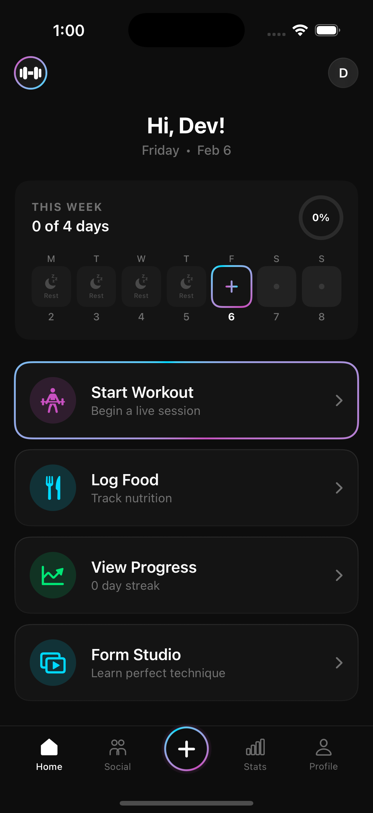
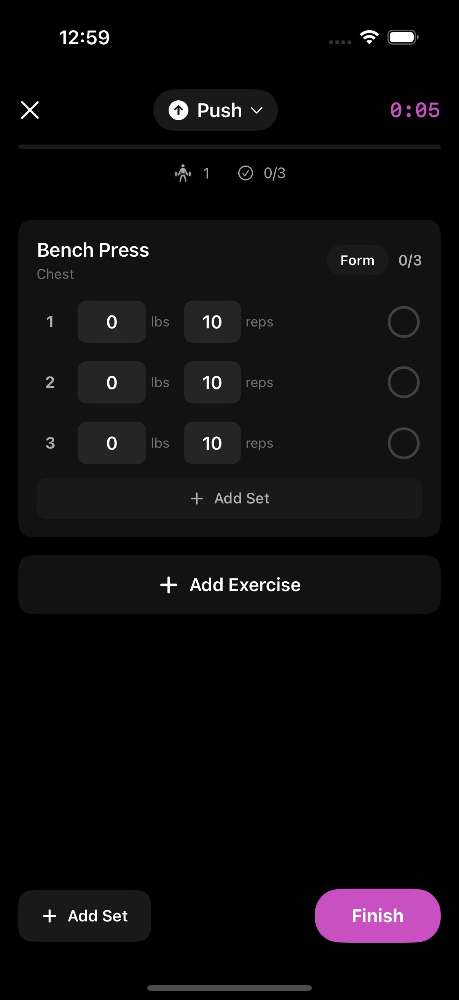

# GymQuest

A gamified fitness app for iOS with real time workout tracking, multi provider AI coaching, and RPG style progression.

> SwiftUI · SwiftData · Swift 5.9 · iOS 17+ · XcodeGen

<p align="center">
  
  &nbsp;&nbsp;&nbsp;&nbsp;
  
</p>

---

## Repo Structure

```
GymQuest/                        ← The App
├── Models/                        SwiftData @Model layer
├── Views/                         25+ screens & components
├── Services/                      18 services (AI, Auth, PR, Strava…)
└── Features/                      Feature modules

Tests/                           ← Quality Engineering
├── Unit/                          Models · Services · ViewModels
├── Integration/                   Network stubs · SwiftData lifecycle
├── Snapshot/                      Visual regression (iPhone 15 + SE)
├── UI/                            Smoke tests · Accessibility audits
├── Performance/                   Benchmarks · Memory leak detection
└── Fixtures/                      JSON response stubs
```

---

## Features

**Workout Engine** · Live set tracking, auto PR detection (weight / rep / volume / est. 1RM), smart rest timers with haptics, RPE capture, ghost data from previous sessions, milestone celebrations

**AI Coach** · Packages workout history, streaks, weekly volume, and deload signals into structured JSON. Supports OpenAI, Groq, Ollama (local), and an offline demo mode

**Gamification** · XP system across 11 levels, quest categories with difficulty tiers, squad challenges, forgiveness tokens

**Social** · Workout cards, coach takeaways, media posts, "Follow this workout", fist bumps, pod based accountability groups

**Design System** · Glassmorphism components (`GlassCard`, `StatPill`, `AnimatedProgressBar`), gradient typography, neon buttons, dark first palette

---

## Tests & CI

50+ test methods across three Xcode targets. Six CI platform configs (GitHub Actions, GitLab, Buildkite, CircleCI, Xcode Cloud, Bitrise) plus Fastlane with 6 lanes. Security scanning via CodeQL, Dependabot, Semgrep, Trivy, and Syft SBOM generation.

---

## Getting Started

```bash
brew install xcodegen
cd GymQuest-iOS
xcodegen generate
open GymQuest.xcodeproj
```

AI setup is optional. The app runs in Demo Mode without API keys.

---

**Benjamin Hilderman** · [@BenHilderman](https://github.com/BenHilderman)
