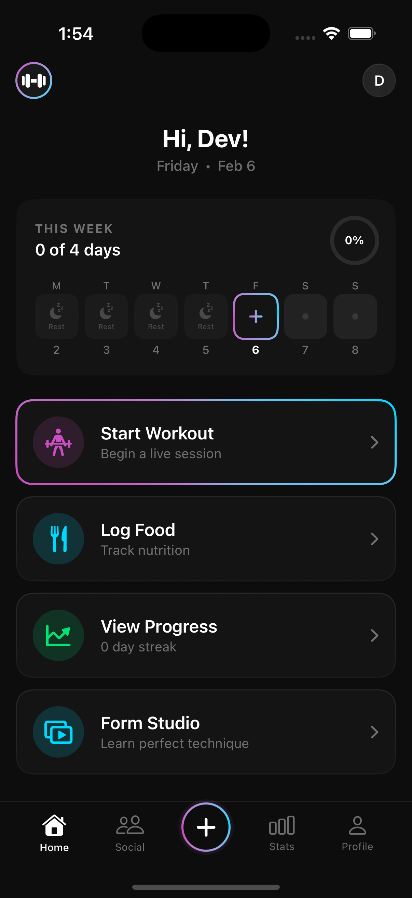

# GymQuest

Gamified fitness app for iOS. Real time workout tracking, multi provider AI coaching, RPG style progression.

> SwiftUI · SwiftData · Swift 5.9 · iOS 17+ · XcodeGen

<p align="center">
  
  &nbsp;&nbsp;&nbsp;&nbsp;
  
</p>

---

```
GymQuest/                        ← The App
├── Models/                        SwiftData @Model layer
├── Views/                         25+ screens & components
├── Services/                      18 services (AI, Auth, PR, Strava…)
└── Features/                      Feature modules

Tests/                           ← Quality Engineering
├── Unit/                          Models · Services · ViewModels
├── Integration/                   Network stubs · SwiftData lifecycle
├── Snapshot/                      Visual regression (iPhone 15 + SE)
├── UI/                            Smoke tests · Accessibility audits
├── Performance/                   Benchmarks · Memory leak detection
└── Fixtures/                      JSON response stubs
```

---

**Workout Engine** · Live set tracking, auto PR detection, rest timers with haptics, RPE, ghost data, milestone celebrations

**AI Coach** · Agentic coaching via LangChain ReAct agent, FAISS RAG over 72 exercises, ACWR/strain analytics, multi-provider LLM (Groq, OpenAI, Ollama), offline demo mode

**Gamification** · 11 XP levels, quests, squad challenges, forgiveness tokens

**Social** · Workout cards, coach takeaways, media posts, fist bumps, pod accountability

**Design System** · Glassmorphism (`GlassCard`, `StatPill`), gradient type, neon buttons

---

**Tests** · 50+ methods across unit, integration, snapshot, UI, and performance targets

**CI/CD** · GitHub Actions · GitLab · Buildkite · CircleCI · Xcode Cloud · Bitrise · Fastlane

**Security** · CodeQL · Dependabot · Semgrep · Trivy · Syft SBOM

---

## Backend

```
backend/
├── main.py              FastAPI server (coach, search, training-load endpoints)
├── coach.py             LangChain ReAct agent with 3 tools
├── rag_engine.py        FAISS + Sentence Transformers (all-MiniLM-L6-v2)
├── training_load.py     ACWR, strain, volume, monotony analytics
├── data/exercises.json  72-exercise knowledge base
└── eval/                25-case / 118-session evaluation harness
```

```bash
cd backend && pip install -r requirements.txt && uvicorn main:app --port 8000
```

---

```bash
brew install xcodegen && cd GymQuest-iOS && xcodegen generate && open GymQuest.xcodeproj
```

AI setup is optional. The app runs in Demo Mode without API keys.

---

**Benjamin Hilderman** · [@BenHilderman](https://github.com/BenHilderman)
