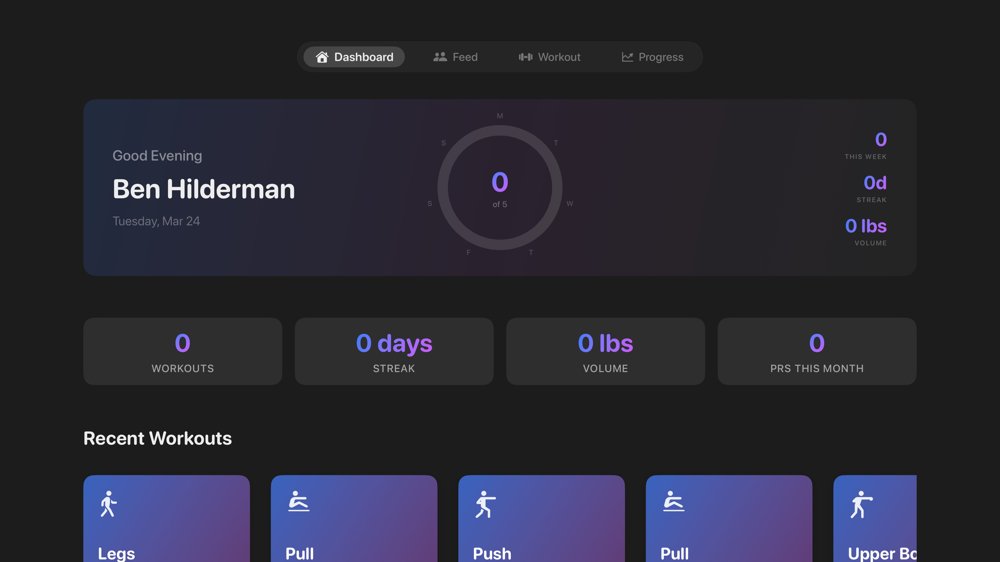
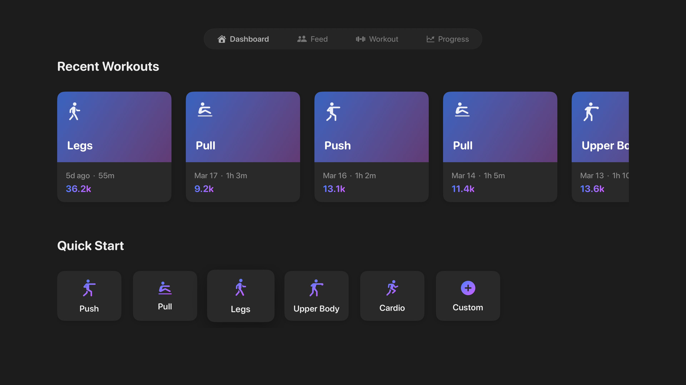
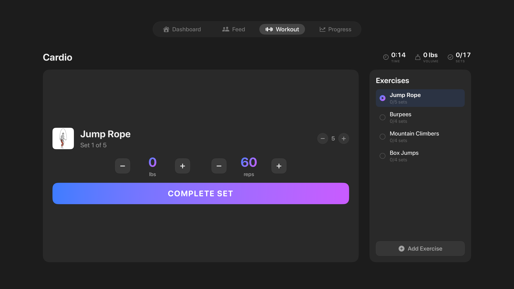
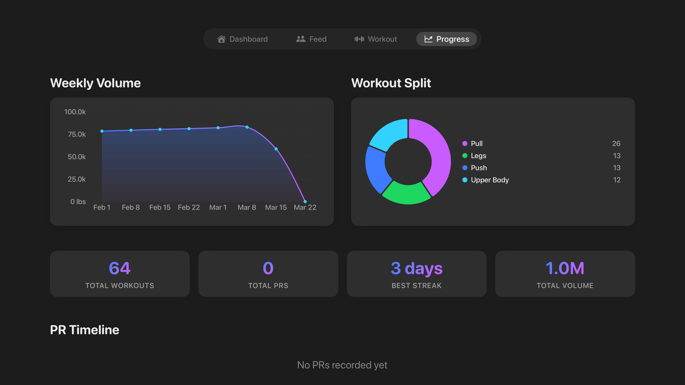

# GymQuest

A full-stack, multi-platform fitness application built with SwiftUI and SwiftData. Real-time workout tracking, multi-provider AI coaching, RPG-style progression, and a social feed across iOS, tvOS, and watchOS.

> SwiftUI · SwiftData · Swift 5.9 · iOS 17+ · tvOS 17+ · watchOS 10+ · Supabase · FastAPI · XcodeGen

---

## iOS

<p align="center">
  
  &nbsp;&nbsp;
  
  &nbsp;&nbsp;
  
</p>

<p align="center">
  
  &nbsp;&nbsp;
  
  &nbsp;&nbsp;
  
</p>

<p align="center">
  
  &nbsp;&nbsp;
  
  &nbsp;&nbsp;
  
</p>

## tvOS

<p align="center">
  
  &nbsp;&nbsp;
  
</p>

<p align="center">
  
  &nbsp;&nbsp;
  
</p>

---

## Features

**Workout Engine** · Live set tracking with rest timers, haptic feedback, RPE logging, auto PR detection, ghost data from previous sessions, and milestone celebrations. Supports Push, Pull, Legs, Upper Body, Cardio, and fully custom splits.

**AI Coach** · Context-aware coaching powered by OpenAI, Groq (Llama 3.3 70B via LangChain), or Ollama for local inference. Falls back to a rule-based offline demo mode when no API key is configured. Onboarding chat flow builds a personalized training plan.

**Training Load Analytics** · Backend-computed ACWR (Acute:Chronic Workload Ratio) and sRPE strain tracking with exponential weighting. Flags undertrained (<0.8), optimal (0.8–1.3), and injury-risk (>1.5) zones. Monotony tracking to detect repetitive strain patterns.

**Gamification** · 11 XP levels, quests with progress tracking, squad challenges, forgiveness tokens, fist bumps, momentum scoring, and comeback plans for returning users.

**Social** · Workout cards, coach takeaways, media posts with photo uploads, reactions, comments, pods (small accountability groups), squads, clubs with leaderboards, and a ranked discover feed.

**Form Studio** · Camera-based form checking with pose detection, 3D exercise viewer, video coaching generation, mastery tracking, and offline HLS downloads for exercise demos.

**Music Integration** · NowPlaying bar, album art service, music preview playback, and workout-synced song display.

**Health & Nutrition** · HealthKit integration for activity and workout sync, meal logging, body measurements, and a health dashboard.

**Integrations** · Strava and Whoop OAuth connections, Apple Watch real-time sync via WatchConnectivity, and deep link support (`liftai://` URL scheme).

**Design System** · `GlassCard`, `HeroCard`, `StatPill`, progress rings, gradient accents (`GQColors`, `GQGradients`), haptic patterns, and a consistent typography scale with `GQTypography`.

---

## Architecture

MVVM with singleton services. Views observe `@Observable` ViewModels and `@MainActor` services. SwiftData handles persistence with 55 `@Model` classes. Supabase provides real-time cloud sync, auth, and storage. Backend runs as a standalone FastAPI microservice for AI coaching and training load math.

```
GymQuest/
├── Models/                        55 @Model classes (SwiftData)
│   ├── Core                         Workout, Exercise, ExerciseSet, PREvent, RoutePoint
│   ├── User & Social                UserProfile, Post, Comment, Friend, Pod, Club, Squad
│   ├── Gamification                 Quest, Challenge, ForgivenessToken, FistBump, MilestoneEvent
│   ├── AI & Coaching                AILogEntry, ChatMessage, CoachNote
│   ├── Health & Nutrition           MealLog, BodyMeasurement, NutritionEntry
│   └── Integrity                    WorkoutAdaptation, MomentumState, AccountabilityNudge
│
├── Views/                         71 SwiftUI views
│   ├── Auth & Onboarding (6)        Login, AI chat setup, training plan builder
│   ├── Dashboard (7)                Today, Progress, Health, Coach dashboard
│   ├── Workout (7)                  Active workout, start options, splits, templates
│   ├── Social & Feed (9)            Discover, friends feed, educational, post editor
│   ├── Community (8)                Clubs, squads, pods, leaderboards
│   ├── Profile & Analytics (6)      Profile, calendar history, body measurements
│   ├── Monetization (4)             Paywall, integrations, notifications
│   ├── Media (3)                    Form check camera, NowPlaying bar
│   └── Components (15)              Progress rings, exercise GIF viewer, voice notes
│
├── Services/                      59 singleton services (@MainActor)
│   ├── AI                           AIService (OpenAI, Groq, Ollama, demo), AIKeychain
│   ├── Workout                      PR detection, progressive overload, adaptation, voice coach
│   ├── Social                       Feed ranking, engagement tracking, challenges, clubs, squads
│   ├── Supabase                     Auth, sync, storage, config (cloud persistence)
│   ├── Integrations                 Strava, Whoop, HealthKit, Apple Watch sync
│   ├── Media                        Music, album art, speech recognition, voice notes
│   ├── Infrastructure               Auth, subscriptions (StoreKit 2), analytics, notifications
│   └── Seeders                      Mock data, discover content, social content, production
│
├── Features/
│   └── FormStudio/ (18 files)       Pose detection, video coaching, mastery, offline HLS
│
GymQuestTV/                        tvOS companion app
├── TVContentView.swift              Tab navigation (Dashboard, Feed, Workout, Progress)
├── TVDashboardView.swift            Weekly activity ring, recent workouts, quick start
├── TVWorkoutView.swift              Guided workout with Siri Remote controls
├── TVFeedView.swift                 Horizontal social feed (Apple Fitness+ inspired)
├── TVProgressView.swift             Volume charts, workout split donut, PR timeline
├── TVLeaderboardView.swift          Ranked exercise leaderboards with est. 1RM
├── TVDesignSystem.swift             10-foot UI: focus states, safe areas, card sizing
└── TopShelfExtension/               Home screen widget (recent workouts + challenges)

GymQuestWatch/                     watchOS companion app
├── GymQuestWatchApp.swift           Entry point with WatchConnectivity
├── WorkoutStartWatchView.swift      Quick workout launcher
├── ActiveWorkoutWatchView.swift     Live set tracking on wrist
├── SummaryWatchView.swift           Post-workout summary
└── WatchConnectivityManager.swift   iPhone ↔ Watch real-time sync

backend/                           Python FastAPI microservice
├── main.py                          REST API with CORS (port 8000)
├── coach.py                         LangChain + Groq Llama 3.3 70B coaching
└── training_load.py                 ACWR, sRPE, strain, monotony calculations
```

---

## Database & Cloud

**Supabase** handles cloud persistence, auth, real-time sync, and file storage.

| Layer | Details |
|-------|---------|
| **Auth** | Email/password signup, JWT (3600s expiry), Google Sign-In (OAuth) |
| **Database** | PostgreSQL 17 with row-level security |
| **Storage** | `post-media` and `profile-photos` buckets, 50MB file limit, S3 protocol |
| **Real-time** | Enabled for live feed updates |
| **Migrations** | 4 versioned SQL migrations (schema, storage policies, workouts, validation) |

Schema includes profiles, posts, reactions, comments, workouts, sets, exercises, training load, and server-side validation constraints on captions, comments, and usernames.

On-device, **SwiftData** persists all 55 model classes locally. Supabase sync is opt-in via feature flags. The app works fully offline.

---

## Testing

```
Tests/                             23 test files
├── Unit (8)                         Models, Services, ViewModels, AIService
├── Integration (3)                  SwiftData lifecycle, network stubs, Strava
├── Performance (2)                  Benchmarks, memory leak detection
├── Snapshot (2)                     Visual regression (iPhone 16 + SE)
├── UI (3)                           Smoke tests (login, clubs), accessibility audit
└── Helpers (5)                      Fixtures, mocks, test containers
```

---

## CI/CD

Seven GitHub Actions workflows, plus four additional CI platforms:

| Platform | Purpose |
|----------|---------|
| **GitHub Actions** | CodeQL analysis, Semgrep SAST, Trivy scanning, SBOM generation, PR quality gates, nightly performance, OIDC deploy |
| **Buildkite** | Project generation → test → UI smoke → performance → coverage |
| **CircleCI** | Apple Silicon executor, parallel device matrix (iPhone 16 + SE), SPM caching |
| **Bitrise** | PR checks, main branch builds, nightly scheduled runs |
| **GitLab CI** | Test → UI test → performance → security pipeline |
| **Xcode Cloud** | Post-clone XcodeGen generation, pre/post build scripts |
| **Fastlane** | `pr_tests`, `ui_smoke`, `full_matrix`, `performance`, `snapshots` lanes |

---

## Security

| Tool | Scope |
|------|-------|
| **CodeQL** | Semantic analysis for Swift vulnerabilities, runs on push + weekly |
| **Semgrep** | SAST for secrets detection and OWASP Top 10, runs on push + weekly |
| **Trivy** | Dependency vulnerabilities and infrastructure misconfigurations |
| **Dependabot** | Weekly Swift package updates, monthly GitHub Actions updates |
| **Syft SBOM** | SPDX and CycloneDX software bill of materials on every release |

---

## Tech Stack

| Category | Technologies |
|----------|-------------|
| **Frontend** | SwiftUI, SwiftData, Swift 5.9, Combine |
| **Platforms** | iOS 17+, tvOS 17+, watchOS 10+, macOS 14+ |
| **Backend** | Python, FastAPI, LangChain, Groq, NumPy, Pandas, scikit-learn |
| **Database** | Supabase (PostgreSQL 17), SwiftData (on-device) |
| **Auth** | Supabase Auth, Google Sign-In, StoreKit 2 |
| **Storage** | Supabase Storage (S3), on-device SwiftData |
| **Health** | HealthKit, WatchConnectivity |
| **Integrations** | Strava OAuth, Whoop OAuth |
| **AI Providers** | OpenAI, Groq (Llama 3.3 70B), Ollama (local) |
| **Images** | SDWebImageSwiftUI, exercise GIF database |
| **Build** | XcodeGen, Xcode 15, Swift Package Manager |
| **Testing** | XCTest, swift-snapshot-testing, XCUITest |
| **CI/CD** | GitHub Actions, Buildkite, CircleCI, Bitrise, GitLab CI, Fastlane, Xcode Cloud |
| **Security** | CodeQL, Semgrep, Trivy, Dependabot, Syft SBOM |

---

**Benjamin Hilderman** · [@BenHilderman](https://github.com/BenHilderman)
